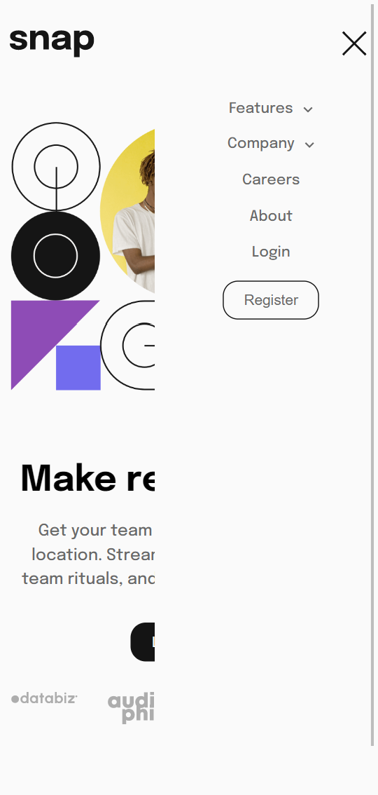

# Frontend Mentor - Intro section with dropdown navigation solution

This is a solution to the [Intro section with dropdown navigation challenge on Frontend Mentor](https://www.frontendmentor.io/challenges/intro-section-with-dropdown-navigation-ryaPetHE5). Frontend Mentor challenges help you improve your coding skills by building realistic projects. 

## Table of contents

- [Overview](#overview)
  - [The challenge](#the-challenge)
  - [Screenshot](#screenshot)
  - [Links](#links)
- [My process](#my-process)
  - [Built with](#built-with)
  - [What I learned](#what-i-learned)
  - [Continued development](#continued-development)
- [Author](#author)


## Overview
An Intro section with a dropdown menu navigation on hover and responsive across all screen sizes
### The challenge

Users should be able to:

- View the relevant dropdown menus on desktop and mobile when interacting with the navigation links
- View the optimal layout for the content depending on their device's screen size
- See hover states for all interactive elements on the page

### Screenshot




### Links

- Solution URL: [Add solution URL here](https://github.com/TRIPLE-ADE/Intro-section-with-dropdown-navigation)
- Live Site URL: [Add live site URL here](https://intro-section-landing-page.netlify.app/)

## My process

### Built with

- Semantic HTML5 markup
- CSS custom properties
- Flexbox
- CSS Grid


### What I learned

Use this section to recap over some of your major learnings while working through this project. Writing these out and providing code samples of areas you want to highlight is a great way to reinforce your own knowledge.

To see how you can add code snippets, see below:

```html
<h1>Some HTML code I'm proud of</h1>
```
```css
*{
    box-sizing: border-box;
    padding: 0;
    margin: 0;
}
:root{
    --Almost-White: hsl(0, 0%, 98%);
    --Medium-Gray: hsl(0, 0%, 41%);
    --Almost-Black: hsl(0, 0%, 8%);
}
body{
    background-color: var(--Almost-White);
    width: 95%;
    margin: auto;
    font-family: 'Epilogue', sans-serif;
}
.hide, .cancel{
    display: none ;
}
.show-subnav:hover  .hide{
    display: block;
}
.register .show-subnav > a {
    color: var(--Medium-Gray);
}
.show-subnav > a{
    display: flex;
}
.show-subnav > a::after{
    content: url("./images/icon-arrow-down.svg");
    padding-left: 10px;
}
.show-subnav:hover > a::after{
    content: url("./images/icon-arrow-up.svg");
}

main{
    display: grid;
    grid-template-columns: repeat(auto-fit, minmax(300px, 1fr));
    gap: 100px;
    min-height: 100vh;
    width: 85%;
    margin: auto;
}
```
```js
const hamburgerEl = document.querySelector('.hamburger');
const navbarEl = document.querySelector('.navbar');
const closeMenuEl = document.querySelector('.close');


hamburgerEl.addEventListener('click', function(e) {
navbarEl.childNodes[3].classList.toggle("hide-nav");
hamburgerEl.classList.add("hide-nav")
closeMenuEl.classList.remove("cancel");
})

closeMenuEl.addEventListener("click", function(){
    navbarEl.childNodes[3].classList.toggle("hide-nav");
    hamburgerEl.classList.remove("hide-nav")
    closeMenuEl.classList.add("cancel");
})
```

If you want more help with writing markdown, we'd recommend checking out [The Markdown Guide](https://www.markdownguide.org/) to learn more.


### Continued development

Use this section to outline areas that you want to continue focusing on in future projects. These could be concepts you're still not completely comfortable with or techniques you found useful that you want to refine and perfect.

- Css grid 
- mobile work flow
- Dom manipulation
- javascript array and object manipulation

## Author

- Website - [Triple](https://intro-section-landing-page.netlify.app/)
- Frontend Mentor - [@yourusername](https://www.frontendmentor.io/profile/yourusername)
- Twitter - [@Triple123A](https://twitter.com/Triple123A)


